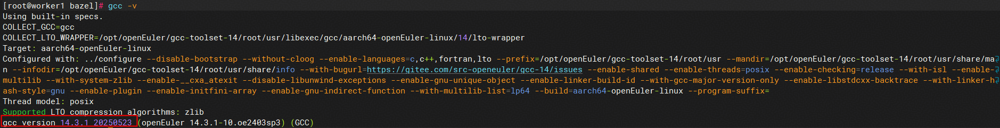
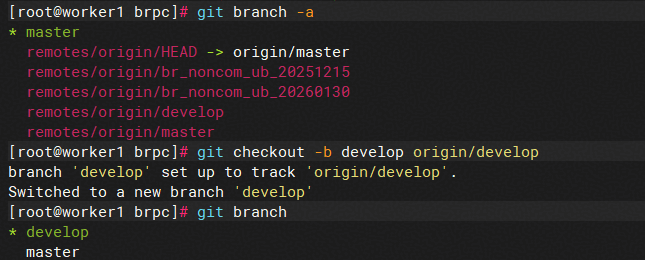
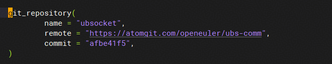
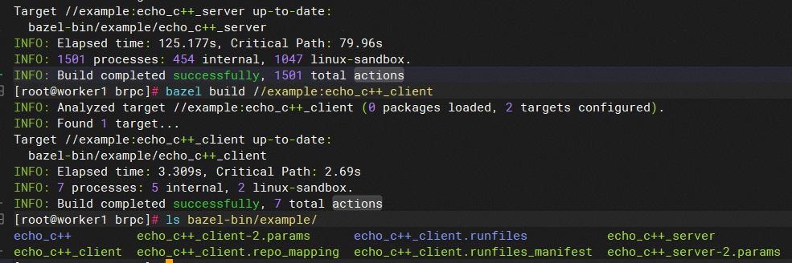
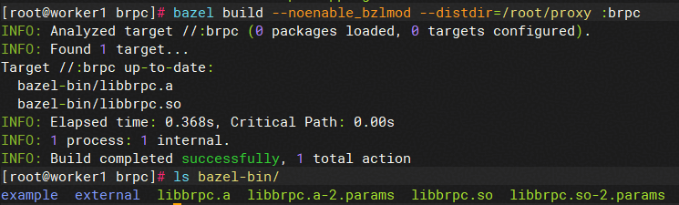
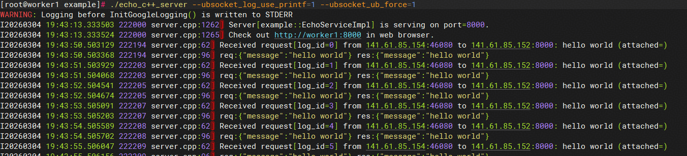
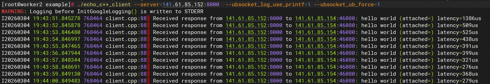

# bazel编译带UB能力的bRPC

## 1 概述

### 1.1 简介

基于[社区bPRC](https://github.com/apache/brpc/)进行修改，支持UB通信，提升RPC性能。

### 1.2 工作原理

[openEuler/ubs-comm](https://atomgit.com/openeuler/ubs-comm)中的ubsocket组件，支持拦截TCP应用中的POSIX Socket API，将TCP通信转换为UB高性能通信。bRPC通过对接ubsocket实现UB通信。

## 2 配套说明

| 软件名称       | 软件版本                                      |
| :------------- | -------------------------------------------- |
| OS             | 含UB OS Component的OS（OpenEuler-24.03-sp3） |
| GCC            | 14.3.1/13.2.0                                |
| Bazel          | 7.4.1                                        |
| protobuf       | 33.0                                         |
| glibc          | v2.34                                        |
| gflags         | 2.2.2                                        |
| gperftools     | 2.17.2                                       |
| leveldb        | 1.23                                         |
| glog           | 0.5.0                                        |
| zlib           | 1.3.1                                        |
| boringssl      | c00d7ca810e3780bd0c8ee4eea28f4f2ea4bcdc      |

## 3 API说明
### 3.1 gflags参数
ubsocket通过环境变量进行配置，在bRPC与ubsocket集成的过程中，为了保持bRPC的使用习惯，将ubsocket的环境变量配置项全部转换成了bRPC的gflags配置项。gflags配置项见下表。

| 名称 | 含义 | 取值范围 | 默认值 | 必填 |
|--|--|--|--|--|
| ubsocket_trans_mode | 通信协议 |ub，ib  | ub | 否 |
|ubsocket_dev_name|设备名称|根据实际场景填写设备名称；例如，udma2或者bonding_dev_0|主动获得当前环境bonding设备名称，如bonding_dev_xx|否|
|ubsocket_eid_idx|使用普通设备的eid编号|ub协议下，通过urma_admin show命令查询获得|0|否|
|ubsocket_src_eid|使用bonding设备的eid|ub协议下，通过urma_admin show命令查询获得|主动获得当前环境bonding设备的eid|否|
|ubsocket_log_level|日志级别|error，warn，notice，info，debug|info|否|
|ubsocket_log_use_printf|是否将日志打印到前台|false，true|true|否|
|ubsocket_tx_depth|发送队列深度|最小值是64，设置上限由实际机器环境决定（根据命令urma_admin show --whole中max_jfc_depth与max_jfs_depth两者的最小值）|1024|否|
|ubsocket_rx_depth|接受队列深度|最小值是64，设置上限由实际机器环境决定（根据命令urma_admin show --whole中max_jfc_depth与max_jfr_depth两者的最小值）|1024|否|
|ubsocket_readv_unlimited|是否打开readv上报限制|false，true|true|否|
|ubsocket_block_type|内存池的最小分片|default：8k，small：16k，medium：32k，large：64k|default|否|
|ubsocket_pool_initial_size|IO内存的总大小，单位MB|应用按需配置|1024|否|
|ubsocket_pool_max_size|单bRPC进程UB通信内存占用弹性扩容最大值，单位MB|[UBSOCKET_POOL_INITIAL_SIZE, 6144]|2048|否|
|ubsocket_buf_pool_depth|单bRPC进程线程内存池深度|应用按需配置|12000|否|
|ubsocket_schedule_policy|设置多平面负载分担策略|affinity_priority, affinity，rr|affinity_priority|否|
|ubsocket_auto_fallback_tcp|	协议不匹配时是否自动降级为TCP|false：协议不匹配时不降级为TCP true：协议不匹配时自动降级为TCP|true|否|
|ubsocket_trace_enable | 是否打开trace统计|false, true | true |否|
|ubsocket_trace_time | 控制维测数据输出间隔（单位s）| [1, 300] | 10 |否|
|ubsocket_trace_file_path | 控制维测数据输出路径，路径长度范围在1到512bytes| [1, 512] | /tmp/ubsocket/log |否|
|ubsocket_trace_file_size | 控制维测数据文件大小（MB）| [1, 300] | 10 |否|
|ubsocket_stats_cli | 是否打开cli服务|false, true | true |否|
|ubsocket_enable_share_jfr|	设置是否开启共享JFR|false：不开启共享jfr<br>true：开启共享jfr|true|否|
|ubsocket_share_jfr_rx_queue_depth|设置开启共享JFR后，每个Socket链接接收缓存队列深度|最小值是64，设置上限由实际机器环境决定|1024|否|
|ubsocket_link_priority|设置URMA流量SL优先级|[0, 15]| -1 |否|
|ubsocket_ub_trans_mode | ub协议模式 |RC_TP，RM_TP, RM_CTP, RC_CTP  | RC_TP | 否 |
|`ubsocket_enable` | 是否启用 ubsocket 加速 | false, true | false | 否 |
|`ubsocket_degrade` | 是否允许 ubsocket 在 UB 错误时降级成 TCP | false, true | true | 否 |

> 注意：
>
> 为最大程度的兼容bPRC及gflags的使用习惯。新增的这些gflags配置项，均在bRPC的源码中指定了默认值。bRPC集成ubsocket的场景中，ubsocket自身的环境变量不再生效，以gflags的默认值或用户指定的gflags值为准。
### 3.2 配置项
在bRPC与ubsocket集成过程中，会增加配置项保证相关资源在使用ubsocket时正确初始化，配置项一般需要client和server侧同时配置生效。

#### 3.2.1 brpc::ChannelOptions
client侧的配置，使用参考[echo_c++_client用例](../../example/echo_c++/client.cpp)。配置项说明见下表。

|名称|含义|取值范围|默认值|必填|
|--|--|--|--|--|
|use_ub|client侧是否使用ub通信，单独设置预期建链失败|false, true|false|否|
#### 3.2.2 brpc::ServerOptions
server侧的配置，使用参考[echo_c++_server用例](../../example/echo_c++/server.cpp)。配置项说明见下表。

|名称|含义|取值范围|默认值|必填|
|--|--|--|--|--|
|use_ub|server侧是否使用ub通信，单独设置预期建立TCP链路|false, true|false|否|

## 4 bazel编译

### 4.1 安装基础软件

执行以下命令安装各步骤所需要的基础软件。
```
$ yum install gcc-toolset-14-* zip vim tar unzip cmake make -y
$ yum install patchelf perl hdf5-devel -y
$ yum install python python3-pip python3-devel wget git -y
$ yum install automake libtool -y
```
安装完成后，需配置gcc相关的环境变量，并确认gcc是否正确安装
```
$ # 使用gcc14自带的脚本，完成PATH和LD_LIBRARY_PATH等环境变量配置
$ source /opt/openEuler/gcc-toolset-14/enable
$ # 通过gcc -v确认gcc是否正确安装
$ gcc -v
```

如图显示"gcc version 14.x.x"，表明安装成功

接下来继续安装bazel，推荐直接下载bazel 7.4.1可执行文件。
```
$ wget https://github.com/bazelbuild/bazel/releases/download/7.4.1/bazel-7.4.1-linux-arm64 --no-check-certificate
$ chmod +x bazel-7.4.1-linux-arm64
$ cp bazel-7.4.1-linux-arm64 /usr/local/bin/bazel
```
### 4.2 下载bRPC源码

通过git clone方式下载bRPC源码，并确保切换到目标分支或tag。
```
$ git clone https://gitcode.com/fanzhaonan/brpc.git
$ cd brpc && git branch
```


默认下载仓库仅存在master分支，如需其他分支可通过如下命令：
```
$ # 列出所有远程分支
$ git branch -a
$ # 创建并切换到本地分支 git checkout -b [分支名] origin/[分支名]
$ git checkout -b develop origin/develop
```


本地新增develop分支表示创建成功，其他分支类似

### 4.3 修改使用的ubs-comm版本
通过修改ubs-comm的commit-id，可以指定ubs-comm版本。在brpc根目录的local_deps_ext.bzl中找到ubsocket依赖，修改commit-id值即可（使用简版8位字符串或详细40位字符串的commit-id均可）。
```
 git_repository(
		name = "ubsocket",
		remote = "https://atomgit.com/openeuler/ubs-comm",
		commit = "c8076b68d5b27cd5f0ef5a98ede765e06130d6e4",
	 )

```

>说明：
>
>- remote字段值一般不作修改，表示ubsocket仓库链接。

### 4.4 编译

bazel支持自动检测依赖变化，能够实现高效的增量编译，建议直接编译可执行文件。如可通过如下命令，编译brpc示例中的echo_c++。
>说明：如果配置代理，需要配置https协议对应的证书。
>例：在代码根目录下`vim .bazelrc`，在最下面加上如下配置
>startup --host_jvm_args=-Djavax.net.ssl.trustStore=/etc/ssl/certs/java/[证书路径]
>startup --host_jvm_args=-Djavax.net.ssl.trustStorePassword=changeit
>startup --host_jvm_args=-DBAZEL_TRACK_SOURCE_DIRECTORIES=1

```
$ cd brpc  #在代码根目录下执行编译命令
$ bazel build -c opt //example:echo_c++_server --define brpc_with_urma=true  # 编译服务端，编译产物在 brpc/bazel-bin/example
$ bazel build -c opt //example:echo_c++_client --define brpc_with_urma=true  # 编译客户端，编译产物在 brpc/bazel-bin/example
```

>说明：
>1.在bazel编译的时候 后面添加`--define brpc_with_urma=true` 使能ubsocket，默认不使能；
>2.在bazel编译的时候 后面添加`--compilation_mode=opt`（或简写`-c opt`），可以自动设置高级别的编译器优化选项（如-O2），能够提高性能，适合发布版本场景

当然，也可以根据需要仅编译出libbrpc.a，后续再用该静态库编译可执行文件。
```
$ cd brpc  #在根目录下执行编译命令
$ bazel build --noenable_bzlmod --distdir=/root/proxy :brpc # 编译产物在 brpc/bazel-bin中
```

> 说明：
>编译参数“--noenable_bzlmod ”表示不使用bzlmod特性，主要依赖在WORKSPACE中已添加；
>编译参数“--distdir=/root/proxy ”指定下载路径，WORKSPACE中的相关三方依赖，例:protobuf、gflags、leveldb等会自动下载到该路径，可以根据需要配置。

编译ub_performance测试工具

```
$ cd brpc  #在根目录下执行编译命令
$ bazel build -c opt //example:ub_performance_server --define brpc_with_urma=true
$ bazel build -c opt //example:ub_performance_client --define brpc_with_urma=true
```

默认情况下编译的产物不会带有 debuginfo, 可能调试不便。可以使用如下几个命令编译带有 debuginfo 的二进制, 以编译 `echo_c++_client` 为例。

```bash
# 在同一宿主机编译、运行, 或者在同一容器内编译、运行
bazel build //example:echo_c++_client --define brpc_with_urma=true -c opt --copt=-g --cxxopt=-g --strip=never

# 在容器 A 内编译，但是产物会在容器 B 中执行. 使用此种模式编译速度会变慢
bazel build //example:echo_c++_client --define brpc_with_urma=true -c opt --copt=-g --cxxopt=-g --strip=never --fission=no

# 以上两种都使用了 -c opt, 隐含着 -O2. 如果在 gdb 时发现较多 variable optimized 时，可能需要把 -c opt 改成 -c dbg.
```

### 4.5 执行用例
#### 4.5.1 TFO选项开启配置
由于当前UB建链操作依赖TFO选项，需要在执行前，确认执行环境开启了TFO。
确认TFO开启：
```bash
# 确保值为3
cat /proc/sys/net/ipv4/tcp_fastopen
```

宿主机开启TFO：
```bash
echo "net.ipv4.tcp_fastopen = 3" | sudo tee -a /etc/sysctl.conf
sudo sysctl -p
```

容器开启TFO：
1. 创建具备CAP_SYS_ADMIN权限的容器

```yaml
# 在容器创建的yaml模板中，spec/containers/securityContext中，新增capabilities配置，参考如下：
securityContext:
  privileged: false
  capabilities:
    add: ["SYS_ADMIN"]
```

2. TFO选项开启命令
* 方案一：在容器在容器创建的yaml模板中，command补充使能TFO命令，然后基于模板创建容器
```yaml
containers:
- command:
  - /bin/sh
  - -c 
  - |
    mount -o remount,rw /proc/sys
    echo 3 > /proc/sys/net/ipv4/tcp_fastopen
    mount -o remount,ro /proc/sys
    while true; do sleep 1000; done
```
* 方案二：使用步骤1中的模板创建容器后，进入容器手动执行如下命令：
```bash
mount -o remount,rw /proc/sys
echo 3 > /proc/sys/net/ipv4/tcp_fastopen
mount -o remount,ro /proc/sys
```

#### 4.5.2 执行验证
上述完成后可以获得echo_c++_server和echo_c++_client两个可执行文件，分别放到放到两台服务器上
```
$ # 启动echo_c++_server
$ ./echo_c++_server --ubsocket_enable=true --use_ub=true

$ # 在另一个节点启动echo_c++_client
$ ./echo_c++_client --server=141.61.85.60:8000 --ubsocket_enable=true --use_ub=true
```


echo_c++用例执行成功，server与client互发“hello_world”
>说明：
>
>- 根据服务器实际情况，调整gflags参数，详见本文gflags介绍。
>- ubsocket为每个线程做了`thread local cache`提升性能（每个线程需额外占用内存），另外超过可用CPU核数的线程不会实际并发起来，故建议根据实际需要配置bRPC线程数以合理使用资源。参考[worker线程数](server.md#worker线程数)进行配置即可。

ub_performance测试工具执行方法

```
$ # 启动ub_performance_server
$ ./ub_performance_server --use_ub=true --ubsocket_enable=true

$ # 在另一个节点启动ub_performance_client
$ ./ub_performance_client --server=141.61.85.60:8002  --use_ub=true --ubsocket_enable=true
```

### 容器内调试

通常来说容器内的 `kernel.core_pattern` 跟随主机，而主机一般情况下都是由 `systemd-coredump` 来管理 coredump 的。
但是容器是没有 systemd 服务的，所以为了能够在容器中产生 coredump 文件，需要将它直接转储至文件。

```bash
mkdir -p /home/share/corefiles
# 常用格式 %p 表示进程 pid, 其他格式可以参考 https://man.archlinux.org/man/core.5
sysctl -w kernel.core_pattern=/home/share/corefiles/core.%p
```

还是以 `echo_c++_client` 为例，如果发现 `objdump -dS ./bazel-bin/example/echo_c++_client` 中没有包含源码信息，可以先进入 `cd $(bazel info execution_root)` 目录，然后再使用

```bash
objdump -dS ./bazel-out/aarch64-dbg/bin/example/echo_c++_client
```

原因是 bazel 沙盒机制和构建封闭性 (Hermeticity) 共同导致的。bazel 不是在当前项目的根目录下执行编译的，而是在 execution root 隔离目录，在这个目录下有 external 等第三方依赖、项目源码的软链接。
同时 bazel 为了保证远程缓存命中率和构建可重现性，bazel 的 c++ toolchain 会传递类似 `-fdebug-prefix-map=$PWD=/proc/self/cwd` 的参数给编译器，然后 gcc 编译时生成的 `DW_AT_comp_dir` 就为 `/proc/self/cwd` 了，而 `DW_AT_name` 则为 `example/echo_c++/client.cpp` (brpc 自己的源文件) 或者第三方依赖 `external/_main~local_deps~ubsocket/src/hcom/umq/util/util_vlog.c`. 
所以通过 `DW_AT_comp_dir` 与 `DW_AT_name` 无法找到源文件，所以 `objdump -dS` 的输出中未包含源码信息。
所以，通过进入 execution root 目录，直接运行 objdump 就可以直接找到对应源文件。
