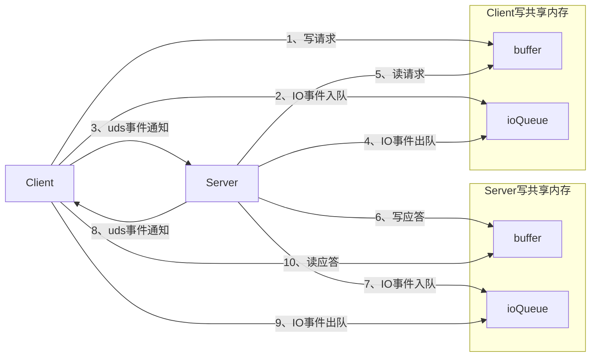
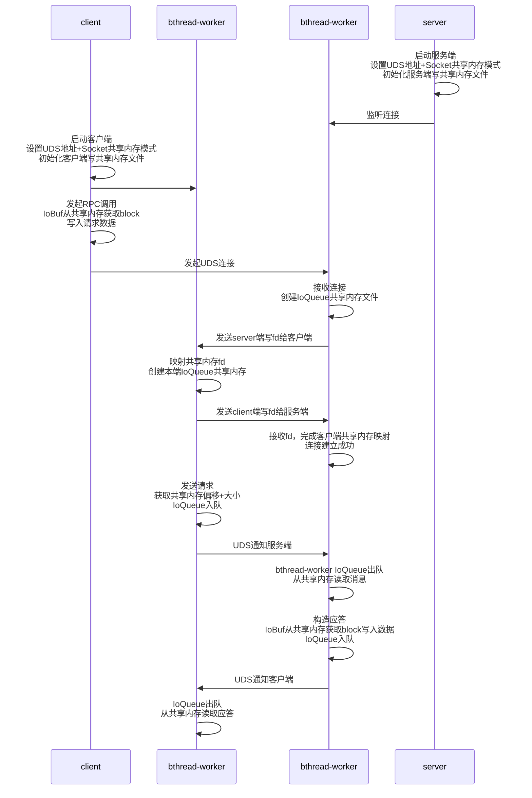

当前brpc支持tcp和uds通信，通过使能共享内存通信提升brpc通信性能。同时为了达到极致性能，实现数据发送接收免拷贝，直接将序列化的数据写入共享内存，而不是序列化到一块非共享内存的 buffer 中，然后再拷贝到共享内存 buffer。

共享内存通信性能优势：

* 零拷贝：数据直接在进程间内存区域传递，无需系统调用和数据拷贝
* 极低延迟：同一台机器内通信，避免了网络协议栈开销
* 高吞吐量：适合大量数据的快速传输
* CPU开销小：不需要网络协议处理，系统调用次数少

共享内存通信的基础流程包含：

（1）共享内存文件创建

（2）共享内存连接，将共享内存段映射到进程的地址空间，使进程可以访问到共享数据

（3）数据读写

（4）同步机制，通知进程进行数据读写

通常共享内存通信每个连接对应数据区和通知队列两块共享内存区域，brpc的通信流程是先构造请求消息，再获取socket进行发送，brpc在构造请求的时候，是序列化层获取buffer填写数据，若要实现数据读写的免拷贝，需要获取到发送通道的共享内存数据区，这从当前brpc的框架上实现比较复杂，序列化层不感知通信层，因此数据区共享内存需要与通信链路无绑定关系。其次，brpc连接方式原始支持单连接和连接池，连接池方式每个连接上同时只发送一个请求，且连接数无上限，若短时间内有大量请求发送会迅速建立大量连接，若每个连接都需要创建独立的共享内存文件，共享内存创建的耗时会导致通信的长尾时延较大。综上，对于brpc支持共享内存通信，创建进程级的共享内存数据区域，通知队列共享内存仍保持每连接一个，每个连接需要独立的通知流程，复用原有的uds通道进行进程间同步。基本思路如下：

（1）进程级共享内存数据区创建，与连接数无关，内存利用率高，适配brpc的线程级tls缓存机制，减少进程内共享内存数据块申请竞争

（2）收发分离，避免跨进程写竞争，每进程创建各自的写共享内存数据区（客户端用于发送请求数据，服务端用于发送应答数据），服务端客户端的收发逻辑完全对称

（3）数据读写免拷贝，一次请求的应答过程中，只有两次拷贝（发送端用户数据->共享内存、接收端共享内存->用户数据）

（4）免拷贝实现仅适配共享内存通信，不影响其它通信方式，可以和其它通信方式共存

（5）批量收割IO，复用已有uds通道，进行进程间同步，如果对端还在处理 IO 队列中的请求，不必进行冗余通知，降低IO开销

（6）连接级通知队列共享内存文件每连接独立，服务端客户端收发对等，各自创建，实现为环形队列，一读一写

（7）数据区共享内存文件实现为CAS免锁链表，一写多读



**一、关键流程**



（1）进程启动时，服务端和客户端各自创建进程级数据区共享内存

（2）新增共享内存通信适配层，连接建立，创建uds通道，服务端创建应答发送通知队列，将应答通知队列和进程级数据区共享内存文件发送给对端

（3）客户端收到共享内存文件fd之后进行映射，创建本端请求通知队列，将本端请求通知队列和数据区共享内存文件fd发送给对端，注意数据区共享内存文件为进程级，多连接进行映射时只需要映射一次，握手完成后共享内存文件资源视图如下

```
Client Process (连接 N 个 Server)
├── Client Send Buffer SHM (1 个, 进程级, 所有连接共享)
├── Server Send Buffer SHM (N 个, 服务端创建)
├── Connection 1 (→ Server A)
│   ├── Request IoQueue SHM (客户端创建)
│   └── Reply IoQueue SHM   (服务端创建)
├── Connection 2 (→ Server B)
│   ├── Request IoQueue SHM (客户端创建)
│   └── Reply IoQueue SHM   (服务端创建)
└── ...
Server Process (被 M 个 Client 连接)
├── Server Send Buffer SHM (1 个, 进程级, 所有连接共享)
├── Client Send Buffer SHM (M 个, 客户端创建)
├── Connection 1 (← Client A)
│   ├── Request IoQueue SHM (客户端创建)
│   └── Reply Queue SHM   (服务端创建)
├── Connection 2 (← Client B)
│   ├── Request IoQueue SHM (客户端创建)
│   └── Reply IoQueue SHM   (服务端创建)
└── ...
```

（4）发送免拷贝在序列化层实现，新增序列化流ShmZeroCopyOutputStream，实现自定义 google::protobuf::io::ZeroCopyOutputStream，区别是从共享内存中获取数据块。

（5）共享内存获取的数据块复用brpc IOBuf::Block数据结构，参考 IOBuf 现有的 g_tls_data 机制，创建线程局部变量缓存从共享内存分配的IOBuf::Block，允许同一线程的多次小消息序列化共享同一个 Block，也可以减少消息创建过程中的跨线程竞争。

（6）消息构造后计算请求在共享内存的偏移和大小，入队通知对端，通知队列设置标志位，标记对端是否在处理请求，若对端正在处理不需要再进行通知，减少IO开销

（7）接收端使用 append_user_data接口实现免拷贝

（8）Block 回收使用双标记位，当两个条件均满足时进行回收：①IoBuf使用完block以后释放，标记write_complete，可以进行回收 ②使用计数标记写入消息片数量，当消息全部读取完毕后可以进行回收

**二、配置参数**
1、GFlags

| 参数 | 默认值 | 推荐值 | 说明 |
|------|--------|--------|------|
| `--shm_buff_size` | 1GB | 根据并发量调整 | 全局共享内存缓冲区总大小|
| `--shm_queue_size` | 1MB | 根据并发量调整 | 每个连接IO队列大小 |
| `--shm_block_size` | 8K | 根据消息大小调整 | 每个共享内存块大小|

2、option 配置
跨进程通知使用uds通信

```cpp
// Server 端
 	 brpc::Server server;
 	 brpc::ServerOptions options;
 	 options.socket_mode = brpc::SOCKET_MODE_MEMFD;  // 关键配置
 	 server.Start("unix:shmsocket", &options);

 	 // Client 端
 	 brpc::Channel channel;
 	 brpc::ChannelOptions options;
 	 options.socket_mode = brpc::SOCKET_MODE_MEMFD;  // 关键配置
 	 channel.Init("unix:shmsocket", &options);
```

**三、性能分析**
1、与TCP性能对比分析

| 维度 | TCP Transport | MemfdTransport（共享内存） |
|------|--------------|--------------------------|
| **数据拷贝** | 2次（用户态→内核态→用户态） | 0次（零拷贝，直接读写共享内存） |
| **系统调用开销** | 每次发送/接收都需要 `send`/`recv` | 仅 `eventfd` 通知（8字节），批量处理时极少 |
| **协议栈开销** | TCP/IP 协议头、校验和、拥塞控制 | 无协议栈开销 |
| **上下文切换** | 每次系统调用涉及用户态/内核态切换 | 数据读写无上下文切换 |
| **延迟** | 高（本机回环仍需经过内核协议栈） | 低 |
| **吞吐量** | 受限于内核 socket buffer 和协议栈处理速度 | 受限于内存带宽 |
| **CPU 占用** | 高（协议栈处理、拷贝、中断） | 低（内存操作 + 原子操作） |
| **连接建立** | TCP 三次握手（1.5 RTT） | memfd 握手（fd 传递，略慢于 TCP） |
| **批量处理** | 受限于 socket buffer 大小 | 批量出队 |

2、推荐配置
shm_block_size应略大于典型消息大小，避免大消息跨block拆分，跨block拆分需要多次入队和多次引用计数操作，shm_buff_size 和shm_queue_size 决定内存容量，应保证高峰期时不会出现共享内存不足的情况，导致回退到内存申请+拷贝到共享内存，且需要等待共享内存可用。

| 场景 | shm_buff_size | shm_block_size|shm_queue_size  |说明 |
|---|---|---|---|---|
| 大包(MB级别)、吞吐敏感 |4-16G | 64MB | 16MB |数据量大，保证内存充足，减少大消息跨block拆分|
| 小包(KB级别)高QPS |1-4G | 4-8MB | 4-8MB |小包场景block占用少，保证内存够用即可|

优化思路：
长连接复用：握手开销大，避免频繁建连
监控回退路径：如果日志出现“Get BLOCK malloc”，说明共享内存耗尽，数据走了malloc回退，需要增大shm_buff_size
监控出队：如果日志出现“Failed to enqueue”，说明队列耗尽，需要增大shm_queue_size

**四、适用场景**

1、推荐使用场景

| 场景 | 原因 |
|------|------|
| **同机进程间通信** | 共享内存的核心优势场景，零拷贝直接读写同一块物理内存 |
| **高吞吐数据传输** | 大文件/模型/视频等传输，输入/输出数据量大，共享内存避免序列化拷贝，避免 TCP 协议栈拷贝瓶颈 |
| **低延迟微服务** | 同机部署的微服务间调用，延迟可降至 TCP 的 1/3-1/5 |
|**少量长连接场景**|握手开销占比高，不适合大量短连接|

2、不适用场景

| 场景 | 原因 |
|------|------|
| **跨机器通信** | 共享内存仅限同机进程，跨机器必须使用 TCP/RDMA |
| **跨平台需求** | `memfd_create` 仅 Linux 支持 |
| **内存受限环境** | 默认 4GB 共享内存占用较大，嵌入式/容器环境需谨慎 |
| **需要网络语义** | 如需拥塞控制、重传、加密等网络特性，应使用 TCP |


