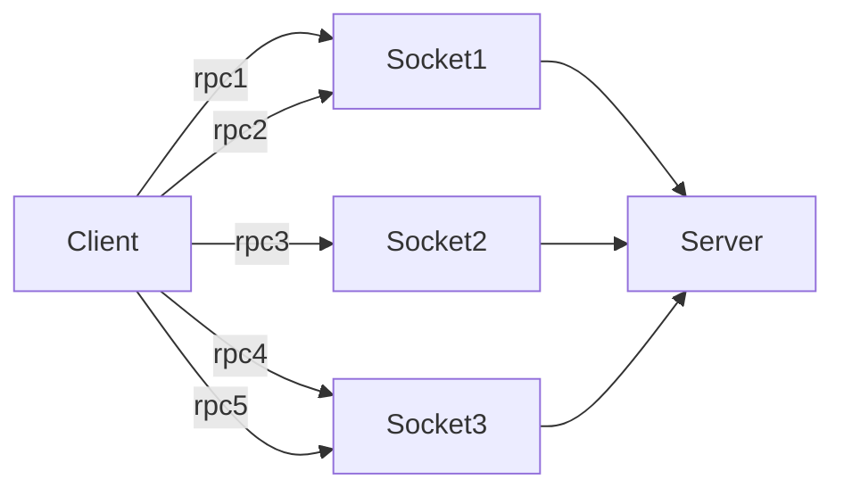
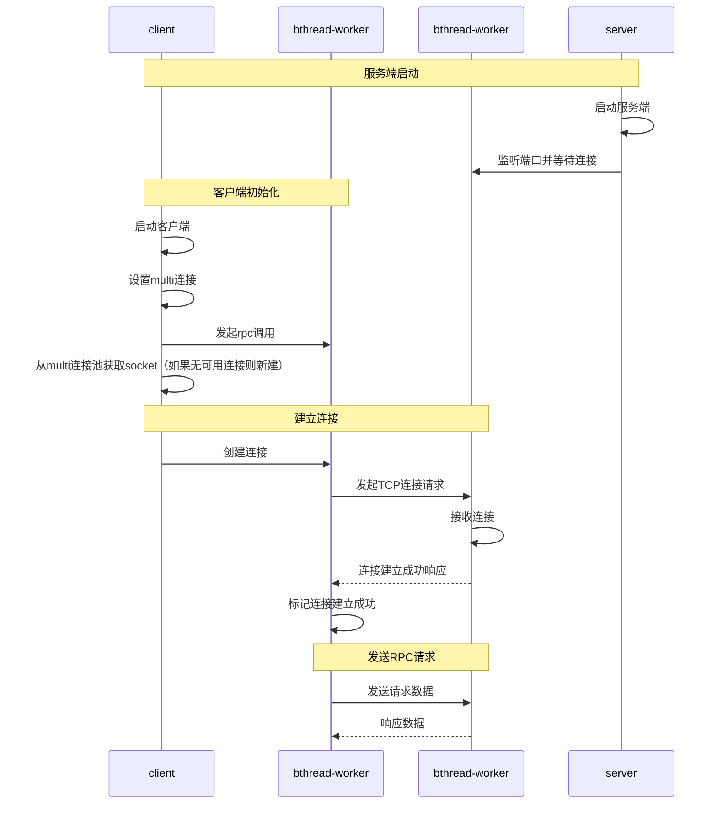
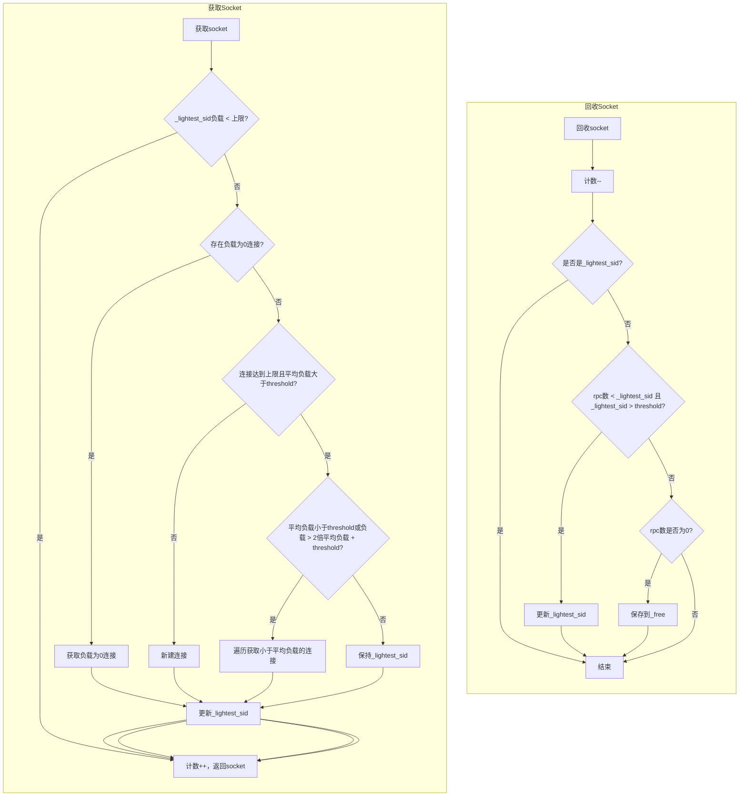

当前brpc支持单连接和连接池两种连接方式。

* 单连接客户端与服务端保持一个连接，一个连接上可以同时发送多个rpc请求，从而发送的多个请求可以被合并，从而降低读写开销，但是当网络不稳定，连接出现抖动时，一大批请求都会受到影响。
* 连接池方式，一个客户端进程与服务端有多个连接，连接无上限，一个连接上每次最多写一个请求。网络抖动只影响一个请求，但是在小包高qps场景中，系统IO读写开销的占比会非常显著。

为提升性能，可以结合两种连接方式，每个连接上支持同时发送多个rpc请求，client与server保持固定连接数，相比single可以更好地应对网络抖动，相比pooled可以节省连接数和读写开销。



### **一、关键流程**
1、客户端创建channel时，设置连接方式为multi连接，客户端发起rpc调用，根据multi连接方式，从池中获取socket，其余流程不变



2、multi连接池连接获取和释放流程如下：



a、每个连接上记录当前正在进行的rpc调用数，用于表示负载

b、新增一个类SocketMultiPool用于管理连接，包含以下字段：

_lightest_sid：当前负载最轻连接Id，每次获取socket或归还socket时，需要判断是否更新_lightest_sid

_free：数组，保存当前负载为0的连接Id

_multiple：数组，保存所有连接Id

c、最大连接数（默认10）和每个连接上发送的rpc请求上限（默认100）支持用户设置

d、当连接到达上限后，为保证所有连接上rpc请求数是均匀的，通过随机遍历所有连接，找到低于平均值负载的连接

e、为避免频繁进入遍历，设置当前连接上的rpc请求数大于上限+2倍平均值时，才进入遍历查找

### **二、配置参数**

1、GFlags

| 参数 | 默认值 | 说明 |
|---|---|---|
| `--gap_threshold_for_multiple_connections` | 100 | 单连接负载阈值，低于此值保持在 `_lightest_sid` 上发送 |
| `--max_connection_multiple_size` | 10 | 到单个远端的最大 MULTI 连接数 |

2、Channel 配置

brpc::ChannelOptions options;
options.connection_type = "multi";  // 或 CONNECTION_TYPE_MULTI

### **三、性能分析**

1、低负载场景（QPS < threshold）等同于单连接，高负载时自动扩展为多条连接，类似连接池，但每条连接仍有写合并，性能优于连接池。

| 场景 | 单连接 | 连接池 | MULTI |
|---|---|---|---|
| 1 并发 | 1 sys write（合并） | 1 sys write | 1 sys write（合并） |
| 10 并发 | 1~2 sys write（合并） | 10 sys write | 1~3 sys write（部分合并） |
| 100 并发 | 1~5 sys write（合并，但单连接成为瓶颈） | 100 sys write | 10~30 sys write（多连接+合并） |
| 1000 并发 | **严重瓶颈**（单连接写缓冲溢出） | 1000 sys write | 50~100 sys write（最优） |

2、推荐配置
小包：大threshold + 多连接 -> 最大化写合并
大包：小threshold + 少连接 -> 分散缓冲压力

| 场景 | gap_threshold | max_connection_multiple_size | 说明 |
|---|---|---|---|
| 低 QPS（<1000） | 100（默认） | 10~20 | 低负载保持单连接优势 |
| 中等 QPS（1000~10000） | 10~20 | 50~100 | 适度扩容 |
| 高 QPS（>10000） | 20~50 | 100~200 | 充分利用多连接分散压力 |
| 大包体场景 | 5~10 | 50~100 | 大包体写合并效果更明显，threshold 不宜过大 |
| 低延迟敏感 | 5~10 | 20~50 | 减少单连接排队延迟 |

### **四、适用场景**

1、推荐使用 MULTI 的场景

**负载波动大的服务**：白天高峰、夜间低谷，MULTI 自动伸缩连接数，无需手动调优
**单连接瓶颈场景**：高 QPS 下单连接写缓冲成为瓶颈，MULTI 自动扩展连接
**连接池开销大的场景**：连接池每请求一次 write，MULTI 的写合并显著减少 CPU 开销
**混合负载场景**：既有大量小请求（受益于写合并），又有偶发大请求（需要独立连接避免阻塞）

2、不推荐使用 MULTI 的场景

**极低 QPS 场景**（<10 QPS）：单连接即可满足，MULTI 的调度开销无意义
**需要严格请求隔离的场景**：MULTI 在低负载时多个请求共享连接，一个请求异常可能影响同连接的其他请求
**协议不支持 MULTI**：部分协议仅支持 `pooled` 和 `short`（如 `nshead`、`thrift`、`esp`）

3、与其他连接方式的选择决策树

```
 	 是否需要长连接？
 	 ├── 否 → 短连接 (short)
 	 └── 是
 	     ├── QPS 是否极低 (<10)？
 	     │   └── 是 → 单连接 (single)
 	     ├── 负载是否稳定且可预测？
 	     │   ├── 是 → 连接池 (pooled) 或 单连接 (single)
 	     │   └── 否 → 多连接 (multi)
 	     └── 是否有写合并需求（高 QPS 小包体）？
 	         ├── 是 → 多连接 (multi) 或 单连接 (single)
 	         └── 否 → 连接池 (pooled) 	 ```
                                  
```

### 五、自适应连接数调节算法

1. 核心问题

当前 MULTI 连接的两个关键参数 `gap_threshold` 和 `max_connection_multiple_size` 是静态 GFlag，需要用户根据场景手动设置：

| 参数 |  冲突原因 |
|---|---|
| `gap_threshold` |  小包需要高阈值保护写合并，大包需要低阈值早分散 |
| `max_connection_multiple_size` | 小包需多连接分散 CPU 压力，大包需少连接保证 TCP 窗口效率 |

**根本矛盾**：小包场景的瓶颈是 **CPU（sys_write 次数）**，大包场景的瓶颈是 **带宽/缓冲区（`_unwritten_bytes`）**。静态参数无法同时适配两种瓶颈模式。

2. 算法设计思路

核心思想：**用运行时指标自动识别瓶颈类型，动态调整调度策略**。新增 --enable_multi_connection_adaptive=true GFlag，关闭时退化为静态参数。

关键观察：
- 小包场景：`_rpc_count` 高但 `_unwritten_bytes` 低 → 瓶颈在 CPU
- 大包场景：`_rpc_count` 低但 `_unwritten_bytes` 高 → 瓶颈在带宽/缓冲区
- 混合场景：两者都高 → 需要综合权衡

3. 算法流程图
┌───────────────────────────────────────────────────────────────────────────┐
│                    每秒自适应调整周期                                        │
├───────────────────────────────────────────────────────────────────────────┤
│                                                                           │
│  1. 采集信号                                                               │
│     ├── _rpc_count (全局在途请求数)                                         │
│     ├── _total_unwritten (总未写出字节)                                     │
│     ├── _total_unwritten_num (总未写出消息数)                               │
│     ├── _write_syscall_count (周期内累计系统调用次数)                         │
│     └── _num_created (当前连接数)                                           │
│     └── _total_rpc_count (周期内累计已发送请求总数)                           │
│                                                                           │
│  2. 计算特征                                                               │
│     ├── avg_req_bytes = total_unwritten/total_unwritten_num               │
│     ├── buffer_pressure = unwritten / num_created                         │
│     └── write_merge = total_rpc_count / write_calls                       │
│                                                                           │
│  3. 瓶颈分类                                                               │
│     ├── avg_bytes < 4KB && pressure < 2MB → SMALL_PACKET                  │
│     ├── avg_bytes > 64KB || pressure >= 2MB → LARGE_PACKET                │
│     └── 其他 → MIXED                                                       │
│                                                                           │
│  4. 参数调节                                                               │
│     ├── SMALL_PACKET:                                                     │
│     │   // 基于base，结合qps_growth和merge_growth动态增长gap                 │
│     │   // 目标合并率用于判断写合并率是否达标                                  │
│     │   target_merge = 64KB / avg_bytes                                   │
│     │   write_merge < target_merge * 0.3 → merge_growth = 1.0             │
│     │   write_merge < target_merge * 0.6 → merge_growth = 0.5             │
│     │   // QPS增长因子                                                     │
│     │   qps_growth = sqrt(rpc_count) / avg_req_bytes                      │
│     │   threshold = (1 + merge_growth + qps_growth) × base                │
│     ├── LARGE_PACKET:                                                     │
│     │   // 大包模式：基于目标流量设置gap                                      │
│     │   threshold = 16MB / avg_bytes                                      │
│     └── MIXED:                                                            │
│     │   // 混合模式合并率判断阈值降低，同时结合缓冲区填充率判断                   │ 
│     │   target_merge = 256KB / avg_bytes                                  │
│     │   // QPS增长因子                                                     │
│     │   qps_growth = sqrt(rpc_count / avg_req_bytes)                      │
│     │   write_merge < target_merge * 0.3 → merge_growth = qps_growth * 0.8│
│     │   write_merge < target_merge * 0.6 → merge_growth = qps_growth * 0.3│
│     │   // 缓冲区填充率：判断连接带宽压力                                      │
│     │   buffer_fill = buffer_pressure / 2MB                               │
│     │   buffer_fill > 0.7 → buf_growth = -0.3                             │
│     │   buffer_fill > 0.5 → buf_growth = -0.15                            │
│     │   threshold = (1 + merge_growth + buf_growth) ×base                 │
│                                                                           │
│                                                                           │
│  5. 写入动态参数                                                            │
│     _dynamic_gap_threshold = new_threshold                                │
│                                                                           │
└───────────────────────────────────────────────────────────────────────────┘