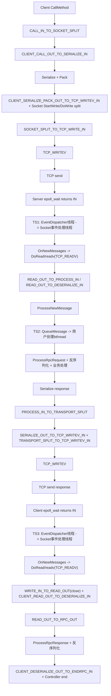
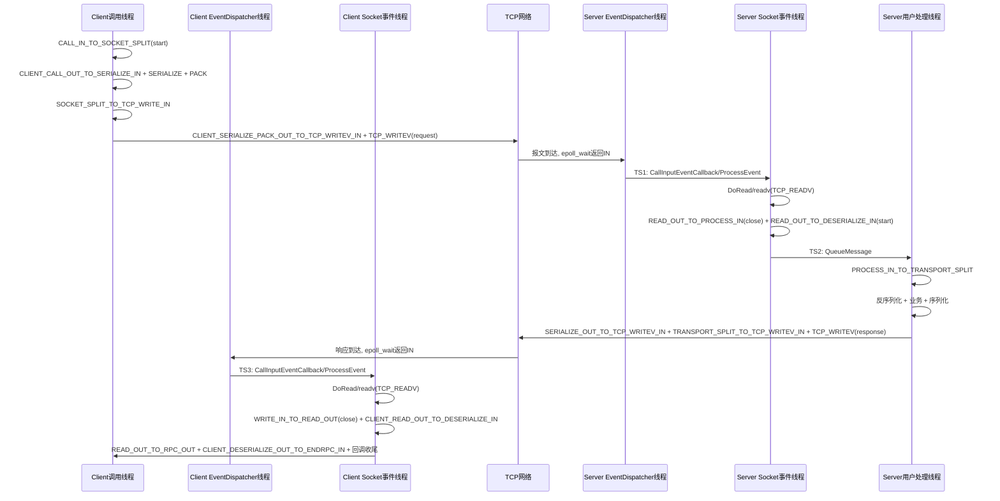
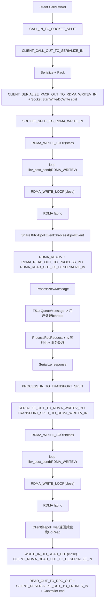
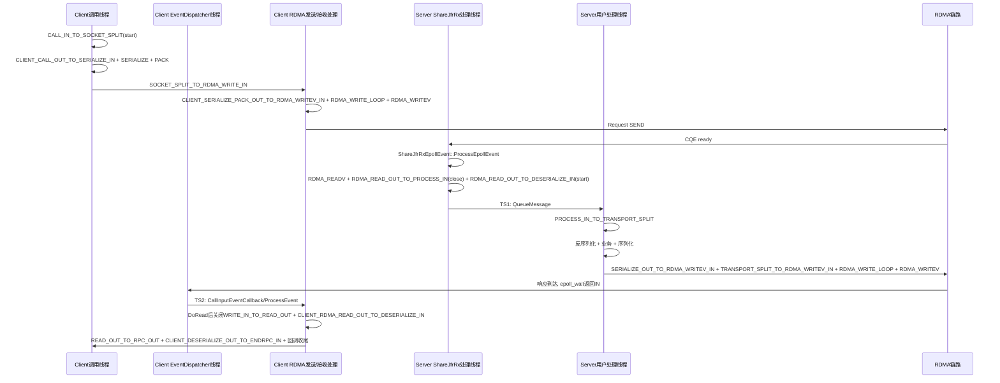

# TCP/RDMA 打点覆盖范围与通信时序

本文基于当前代码实现梳理 `BRPC_STEP` 打点的覆盖范围，并给出 TCP 与 RDMA 的通信流程图、时序图，便于做链路对比分析。原 `brpc-lqc/dot_test` 打点只覆盖 TCP/RDMA；迁移到 `brpc-fzn` 后，新增了 UB 连接方式的同口径打点。

## 1. 当前打点覆盖范围（按语义分组）

### 1.1 端到端与请求总时延

- `BRPC_END2END_STEP`
  - 含义：客户端单次 RPC 端到端时延。
  - 起点：`Controller::latency_start`（RPC begin）
  - 终点：`Controller::OnVersionedRPCReturned` 收尾处。

- `BRPC_CALL_IN_TO_RPC_OUT`
  - 含义：客户端从 `CallMethod` 到 RPC 完成（微秒口径）。
  - 起点：`Channel::CallMethod`
  - 终点：`Controller::OnVersionedRPCReturned`

- `BRPC_CLIENT_CALL_OUT_TO_SERIALIZE_IN`
  - 含义：客户端进入 `Channel::CallMethod()` 后到请求序列化开始前的耗时。
  - 起点：`Channel::CallMethod()` 入口。
  - 终点：调用 `_serialize_request` 前。

### 1.2 发送链路拆分（客户端/服务端发送都可观测）

- `BRPC_CALL_IN_TO_SOCKET_SPLIT`
  - 含义：客户端从 `CallMethod` 到 `Socket` 发送分叉点（TCP/RDMA 公共段）。
  - 起点：`Channel::CallMethod`
  - 终点：`Socket::StartWrite/DoWrite` 进入 transport 分支前。

- `BRPC_SOCKET_SPLIT_TO_TCP_WRITE_IN`
  - 含义：客户端发送分叉后到 TCP `writev` 前。
  - 仅 TCP 客户端路径有效。

- `BRPC_SOCKET_SPLIT_TO_RDMA_WRITE_IN`
  - 含义：客户端发送分叉后到 RDMA `ibv_post_send` 前。
  - 仅 RDMA 客户端路径有效。

- `BRPC_SOCKET_SPLIT_TO_UB_WRITE_IN`
  - 含义：客户端发送分叉后到 UB `writev` 前。
  - 仅 UB 客户端路径有效。

- `BRPC_CLIENT_SERIALIZE_PACK_OUT_TO_TCP_WRITEV_IN`
  - 含义：客户端请求序列化和 pack 完成后到进入 TCP `writev` 前的耗时。
  - 仅 TCP 客户端发送路径有效。

- `BRPC_CLIENT_SERIALIZE_PACK_OUT_TO_RDMA_WRITEV_IN`
  - 含义：客户端请求序列化和 pack 完成后到进入 RDMA `ibv_post_send` 前的耗时。
  - 仅 RDMA 客户端发送路径有效。

- `BRPC_CLIENT_SERIALIZE_PACK_OUT_TO_UB_WRITEV_IN`
  - 含义：客户端请求序列化和 pack 完成后到进入 UB `writev` 前的耗时。
  - 仅 UB 客户端发送路径有效。

- `BRPC_PROCESS_IN_TO_TRANSPORT_SPLIT`
  - 含义：服务端接收后进入 `ProcessNewMessage` 到服务端发送分叉点（公共逻辑）。
  - 起点：`InputMessenger::ProcessNewMessage` 入口。
  - 终点：`Socket::StartWrite/DoWrite` 发送分叉前。

- `BRPC_TRANSPORT_SPLIT_TO_TCP_WRITEV_IN`
  - 含义：服务端发送分叉后到 TCP `writev` 前。
  - 仅 TCP 服务端路径有效。

- `BRPC_TRANSPORT_SPLIT_TO_RDMA_WRITEV_IN`
  - 含义：服务端发送分叉后到 RDMA `ibv_post_send` 前。
  - 仅 RDMA 服务端路径有效。

- `BRPC_TRANSPORT_SPLIT_TO_UB_WRITEV_IN`
  - 含义：服务端发送分叉后到 UB `writev` 前。
  - 仅 UB 服务端路径有效。

- `BRPC_TCP_WRITEV`
  - 含义：TCP 底层发送调用耗时（`writev`）。

- `BRPC_RDMA_WRITEV`
  - 含义：RDMA 单次底层发送调用耗时（单次 `ibv_post_send`）。

- `BRPC_UB_WRITEV`
  - 含义：UB 底层发送调用耗时（`ubsocket_wrapper_writev`）。

- `BRPC_RDMA_WRITE_LOOP`
  - 含义：RDMA 发送侧 `CutFromIOBufList` 内 `post_send` 循环整体耗时（覆盖拆片发送总时间）。

### 1.3 接收链路拆分

- `BRPC_READ_OUT_TO_PROCESS_IN`
  - 含义：TCP 接收侧从 `readv` 返回到进入 `ProcessNewMessage`。
  - 仅 TCP 接收路径有效。

- `BRPC_RDMA_READ_OUT_TO_PROCESS_IN`
  - 含义：RDMA 接收侧从 `ibv_poll_cq` 返回到进入 `ProcessNewMessage`。
  - 仅 RDMA 接收路径有效。

- `BRPC_UB_READ_OUT_TO_PROCESS_IN`
  - 含义：UB 接收侧从 `ubsocket_wrapper_readv` 返回到进入 `ProcessNewMessage`。
  - 仅 UB 接收路径有效。

- `BRPC_READ_OUT_TO_DESERIALIZE_IN`
  - 含义：TCP 服务端从 `readv` 返回到进入 `ProcessRpcRequest` 的 `RpcMeta` 反序列化前。
  - 仅 TCP 服务端接收路径有效。

- `BRPC_RDMA_READ_OUT_TO_DESERIALIZE_IN`
  - 含义：RDMA 服务端从 `ibv_poll_cq` 收到请求数据到进入 `ProcessRpcRequest` 的 `RpcMeta` 反序列化前。
  - 仅 RDMA 服务端接收路径有效。

- `BRPC_UB_READ_OUT_TO_DESERIALIZE_IN`
  - 含义：UB 服务端从 `ubsocket_wrapper_readv` 返回到进入 `ProcessRpcRequest` 的 `RpcMeta` 反序列化前。
  - 仅 UB 服务端接收路径有效。

- `BRPC_CLIENT_READ_OUT_TO_DESERIALIZE_IN`
  - 含义：TCP 客户端从 `readv` 返回到进入 `ProcessRpcResponse` 的 `RpcMeta` 反序列化前。
  - 仅 TCP 客户端接收路径有效。

- `BRPC_CLIENT_RDMA_READ_OUT_TO_DESERIALIZE_IN`
  - 含义：RDMA 客户端从 `ibv_poll_cq` 收到响应数据到进入 `ProcessRpcResponse` 的 `RpcMeta` 反序列化前。
  - 仅 RDMA 客户端接收路径有效。

- `BRPC_CLIENT_UB_READ_OUT_TO_DESERIALIZE_IN`
  - 含义：UB 客户端从 `ubsocket_wrapper_readv` 返回到进入 `ProcessRpcResponse` 的 `RpcMeta` 反序列化前。
  - 仅 UB 客户端接收路径有效。

- `BRPC_TCP_READV`
  - 含义：TCP 底层接收调用耗时（`readv`）。

- `BRPC_RDMA_READV`
  - 含义：RDMA 底层接收调用耗时（`ibv_poll_cq`）。

- `BRPC_UB_READV`
  - 含义：UB 底层接收调用耗时（`ubsocket_wrapper_readv`）。

- `BRPC_UB_READV_OK` / `BRPC_UB_READV_EAGAIN`
  - 含义：UB 接收调用按成功/EAGAIN 拆分的细分耗时。

### 1.4 请求/响应编解码

- `BRPC_SERIALIZE_STEP`
  - 含义：序列化耗时（客户端请求序列化 + 服务端响应序列化）。

- `BRPC_PACK_STEP`
  - 含义：客户端打包请求（组 `RpcMeta` + header/body/attachment）耗时。

- `BRPC_DESERIALIZE_META_STEP`
  - 含义：反序列化 `RpcMeta` 耗时（请求/响应两侧）。

- `BRPC_DESERIALIZE_MSG_STEP`
  - 含义：反序列化消息体耗时（包含校验、解压、protobuf/json 解析）。

### 1.5 服务端 CallMethod 与响应前处理

- `BRPC_SERVER_CALL_METHOD_STEP`
  - 含义：服务端 `Service::CallMethod()` 本身耗时。
  - 起点：框架调用 `svc->CallMethod(...)` 前。
  - 终点：`svc->CallMethod(...)` 返回后。

- `BRPC_SERVER_CALL_OUT_TO_SERIALIZE_IN`
  - 含义：服务端 `Service::CallMethod()` 返回后到响应序列化开始前的耗时。
  - 起点：异步 service 为 `svc->CallMethod(...)` 返回后；同步 service 中若 `done->Run()` 在 `CallMethod()` 内执行，则以 `done->Run()` 入口作为响应前边界。
  - 终点：`SendRpcResponse` 进入 `SerializeResponse` 前。
  - 说明：异步 service 可覆盖 `CallMethod()` 返回到稍后调用 `done->Run()` 的等待/调度间隔；同步 service 主要体现 `done->Run()` 入口到实际序列化前的框架开销。

- `BRPC_SERIALIZE_OUT_TO_TCP_WRITEV_IN`
  - 含义：TCP 服务端响应 `SerializeResponse` 返回后到进入底层 `writev` 前的耗时。
  - 仅 TCP 服务端响应发送路径有效。

- `BRPC_SERIALIZE_OUT_TO_RDMA_WRITEV_IN`
  - 含义：RDMA 服务端响应 `SerializeResponse` 返回后到进入底层 `ibv_post_send` 前的耗时。
  - 仅 RDMA 服务端响应发送路径有效。

- `BRPC_SERIALIZE_OUT_TO_UB_WRITEV_IN`
  - 含义：UB 服务端响应 `SerializeResponse` 返回后到进入底层 `ubsocket_wrapper_writev` 前的耗时。
  - 仅 UB 服务端响应发送路径有效。

### 1.6 客户端回包阶段

- `BRPC_WRITE_IN_TO_READ_OUT`
  - 含义：客户端从发送进入底层到收到响应数据的时延。

- `BRPC_READ_OUT_TO_RPC_OUT`
  - 含义：客户端从“读到响应”到 RPC 完成回调收尾时延。
  - 包含 `DESERIALIZE_META/MSG` 及其前后处理逻辑，不是仅反序列化时间。

- `BRPC_CLIENT_DESERIALIZE_OUT_TO_ENDRPC_IN`
  - 含义：客户端响应反序列化处理完成后到 `EndRPC` 收尾点的耗时。
  - 起点：`ProcessRpcResponse` 完成 `RpcMeta` 和响应体处理后。
  - 终点：`Controller::EndRPC` 记录 RPC 完成前。

---

## 2. TCP 通信流程图



## 3. TCP 时序图



---

## 4. RDMA 通信流程图



## 5. RDMA 时序图



---

## 6. 口径说明与注意事项

- `BRPC_WRITEV/BRPC_READV` 通用项已不再记录；
  当前按 transport 拆分为 `BRPC_TCP_WRITEV/BRPC_TCP_READV` 与 `BRPC_RDMA_WRITEV/BRPC_RDMA_READV`。
- `BRPC_RDMA_WRITE_LOOP` 用于统计 RDMA 拆片发送循环总耗时；
  `BRPC_RDMA_WRITEV` 仅统计每次 `ibv_post_send` 单次调用耗时。
- `BRPC_DESERIALIZE_META_STEP/BRPC_DESERIALIZE_MSG_STEP` 是细粒度子阶段；
  在客户端侧它们被包含在 `BRPC_READ_OUT_TO_RPC_OUT` 大阶段内。
- `BRPC_PROCESS_IN_TO_TRANSPORT_SPLIT` 是服务端公共处理段，不区分 TCP/RDMA；
  transport 专有差异体现在 `*_TO_TCP_WRITEV_IN` 与 `*_TO_RDMA_WRITEV_IN`。

### 6.1 收/发/epoll_wait 关系（含切线程）

- `epoll_wait` 本身不做业务解析，它负责把“可读/可写/异常”事件送到 `CallInputEventCallback`。
- 真实收包处理发生在 `OnNewMessages -> DoRead -> ProcessNewMessage` 链路；真实发包发生在 `StartWrite/DoWrite -> writev 或 ibv_post_send` 链路。
- 线程切换主要有两类：
  - `TS(EventDispatcher -> Socket事件处理线程)`：收到 `EPOLLIN` 后进入 socket 事件处理逻辑。
  - `TS(Socket事件处理线程 -> 用户处理bthread)`：`QueueMessage` 后进入协议处理/业务处理线程。
- 在 share-jfr 场景下，若发生跨 epoll 转发，会出现“第二跳唤醒”：
  - 第一跳：`ShareJfrRxEpollEvent::ProcessEpollEvent` 完成 CQE 轮询与 qbuf 分发。
  - 第二跳：通过 `eventfd` 唤醒目标 epoll，再触发该 epoll 线程继续走 `OnNewMessages/DoRead`。

## 7. 线程模型、epoll 与软件栈开销差异

### 7.1 TCP 与 RDMA 线程模型是否一致

结论：不完全一致。发送侧模型基本一致，接收侧模型有明显差异。

- 发送侧一致点：
  - 都走 `Socket::Write -> StartWrite -> DoWrite / KeepWrite` 的同一套写入调度模型。
  - 高并发下都可能进入 `KeepWrite` 后台 bthread 批量发送。

- 接收侧差异点：
  - TCP：`EventDispatcher` 触发 `InputMessenger::OnNewMessages`，在该回调内 `DoRead` 后直接解析。
  - RDMA：TCP fd 回调先走 `RdmaEndpoint::OnNewDataFromTcp`（握手/状态机）；数据面由 `RdmaEndpoint::PollCq` 处理 CQE 后再调用 `ProcessNewMessage`。
  - RDMA 还存在可选 `rdma_use_polling=true` 轮询线程模型，和 TCP 的事件驱动模型不同。

### 7.2 是否都使用 epoll

结论：默认配置下两者都使用 epoll，但作用对象不同；RDMA 在 polling 模式下可绕开 epoll。

- TCP：
  - 业务 socket fd 注册到 `EventDispatcher`，由 epoll ET 驱动读写事件。

- RDMA（默认非 polling）：
  - 普通 TCP 连接 fd 仍由 epoll 驱动（握手/异常路径）。
  - 另外把 RDMA completion channel 的 fd 也注册为 socket 回调，回调里执行 `PollCq`。
  - 因此是“epoll + verbs completion channel”的组合。

- RDMA（polling 模式）：
  - `FLAGS_rdma_use_polling=true` 时使用 poller 线程周期性 `PollCq`，不依赖 completion channel 的 epoll 事件。

### 7.3 软件栈开销是否有差异

结论：有差异，且差异集中在接收/发送底层与控制面管理。

- TCP 额外开销特征：
  - `readv/writev` 走内核网络栈与 socket 路径。
  - 事件来自 socket fd，可读可写由 epoll 频繁驱动。

- RDMA 额外开销特征：
  - 数据面是 `ibv_post_send / ibv_poll_cq`，绕开 TCP 内核协议栈主路径。
  - 但新增了 RDMA 侧窗口/ACK/信号位管理、CQ 事件通知与 ACK 逻辑、握手状态机等控制开销。
  - 非 polling 模式仍有 completion channel 的事件处理开销；polling 模式减少事件通知延迟，但会提升 CPU 占用。

- 当前实现下的共同开销：
  - 上层编解码、`ProcessNewMessage`、服务逻辑与 `Controller` 收尾是共享的，差异主要在 transport 层。

## 8. 编译期开关

本打点代码由编译期宏 `BRPC_ENABLE_TRACE_SCOPE` 控制，默认关闭。

- 关闭：不传该宏，或传入 `-DBRPC_ENABLE_TRACE_SCOPE=0`，打点相关时间戳读取、全局计数、marker 记录和统计输出会在编译期排除。
- 打开：Bazel 构建时传入 `--define=BRPC_ENABLE_TRACE_SCOPE=true`，顶层库和 example 目标会收到 `-DBRPC_ENABLE_TRACE_SCOPE=1`。

示例：

```bash
bazel build -c opt //:brpc --define=BRPC_ENABLE_TRACE_SCOPE=true
bazel build -c opt //example:ub_performance_client --define=BRPC_ENABLE_TRACE_SCOPE=true
```
